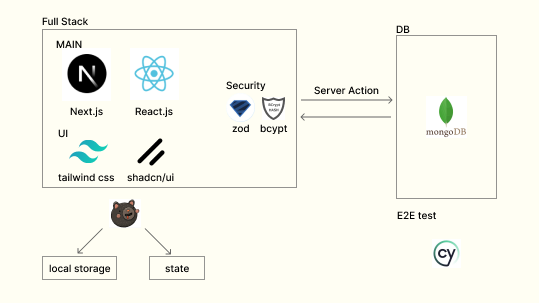

### Climbing

Next.js 포트폴리오

#### View

#### 구조

#### 특징

그동안 배운 것들을 최대한 사용하려고 노력했습니다.

1. 폴더구조를 통한 Capsulation 진행

- next.js는 파일 기반 라우팅이 사용됩니다.
- 폴더가 많이 생기며, 기존 FSD 구조처럼 한 폴더에 각 페이지별 컴포넌트를 모두 넣을 경우, 오히려 복잡성이 증가할 것이라 생각했습니다.
- 그래서 'Co-location'을 기반으로 각 경로별로 비슷한 폴더구조를 유지하고자 하였습니다.
- 다만, 같은 폴더구조가 반복될 위험이 있어 Routing group을 적극 사용하여 폴더 구조의 복잡성을 피하고자 하였습니다.
- 그리고 처음부터 의미없는 폴더를 만드는 것이 아니라 기본틀을 잡고 필요할 경우 폴더를 만들고 파일을 분리하는 방식을 채택했습니다.
- 덕분에 해당 페이지에서 사용되는 컴포넌트 및 함수의 경우 수정이 필요할 때 빠르게 찾을 수 있도록 하여 응집도를 높였습니다.

---

2. Intercept route 사용

---

3. Context Api 분리

- Props drilling 및 불필요한 렌더링 방지를 위해 Context Api 사용
- 그러나 이 경우 구독하는 컴포넌트 모두 렌더링 발생할 수 있음.

 

- Provider에 최소한의 value전달로 렌더링 방지

 

 

- 그러나 이 경우 필요한 value만큼 Provider를 생성해야 합니다.
- 다른 상태만 생겨도 5개까지 금방 증가해서 callback hell과 비슷한 indent 문제가 발생합니다.

- 그래서 zustand를 도입해서 전역에서 관리하기로 결정하였습니다.
- 그리고 selector를 통해서 '수동 최적화'를 진행하기 때문에 각 함수마다 굳이 useCallback으로 메로를 사용할 필요가 없어서, 개발 편의성도 증가했습니다.

---

4. Stateless

- session login의 경우, db에 session을 저장해서 관리하는 방법도 있으나,
- next.js에서 middleware 사용이 가능하고, 간단한 유저기능이기에 stateless 방법이 적합하다 생각했습니다.
- 그리고 middleware로 각 페이지별 접근도 제한하고 있기 때문에, 페이지 이동마다 db에서 session을 확인하기 보다는 stateless로 관리하는 것이 낫다 판단했습니다.
- 그래서 로그인 시에만, db에서 확인하고 그 뒤에는 next.js의 middleware에서 관리합니다.

---

5. CSR, SSR

- 로딩 이후에는 CSR이 속도가 빠릅니다.

- 페이지 이동할 때마다 데이터를 불러와 업데이트 해야 합니다.
- 굉장히 비효율적이라 생각했으며, `useRouter()`와 `Link`를 이용한 prefetching으로 로딩 속도 문제도 해결할 수 있다 SSR을 유지하며 진행했습니다.
- 물론, 이 경우 server에 부하가 생길 수 있어, 값이 잘 변하지 않는 페이지의 경우 ISR로 전환할 예정이고, 데이터 요청또한 caching하기 위해 현재 백엔드 별도 분리 중입니다.
